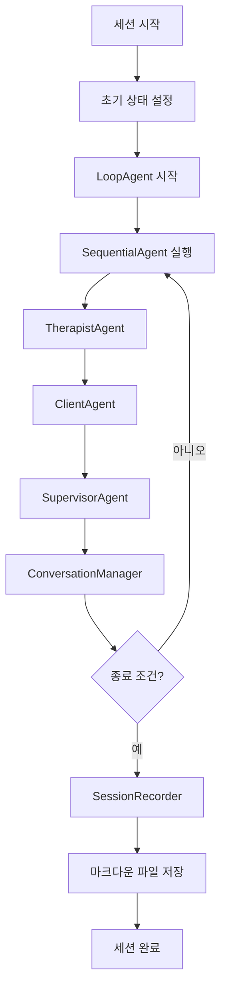

# 🩺 Motivational Interviewing Multi-Agent System

Google Agent Development Kit (ADK)를 사용한 Motivational Interviewing 가상 면담 기록 생성 시스템입니다.

## 📋 개요

이 시스템은 세 개의 전문화된 에이전트가 협력하여 현실적인 Motivational Interviewing 세션을 시뮬레이션합니다:

- **🩺 면담자 (Therapist) Agent**: MI 전문가로서 면담을 주도
- **😊 내담자 (Client) Agent**: 문제를 가진 환자 역할 시뮬레이션  
- **👨‍🏫 슈퍼바이저 (Supervisor) Agent**: 면담자에게 실시간 피드백 제공

## 🏗️ 시스템 아키텍처

### Multi-Agent Workflow

```
면담자 Agent → 내담자 Agent → 슈퍼바이저 Agent → 대화 관리자
    ↓                ↓               ↓              ↓
  질문/개입         반응/응답       피드백/지도     흐름 제어
    ↓                ↓               ↓              ↓
        ← ← ← ← 공유 세션 상태 (Shared Session State) ← ← ← ←
```

### 주요 구성 요소

1. **SequentialAgent**: 턴별 순차 실행 (면담자 → 내담자 → 슈퍼바이저)
2. **LoopAgent**: 전체 세션 반복 실행 (최대 100회)
3. **Shared Session State**: 모든 에이전트가 접근 가능한 공유 메모리
4. **SessionRecorder**: 마크다운 형식으로 세션 기록 저장

## 🚀 설치 및 실행

### 필요 조건

- Python 3.13+
- Google ADK 1.5.0+

### 설치

```bash
# 프로젝트 클론
git clone <repository-url>
cd motivation

# 의존성 설치 (uv 사용 권장)
uv sync

# 또는 pip 사용
pip install -e .
```

### 기본 실행

```bash
# 예시 시나리오 실행
python hello.py

# 또는 직접 모듈 실행
python -m generator_critic.agent
```

## 💻 사용 방법

### 1. 간단한 사용

```python
from generator_critic.agent import run_mi_session_sync

# 세션 실행
output_file = run_mi_session_sync(
    client_problem="35세 직장인의 음주 문제...",
    session_goal="음주 패턴 성찰 및 대안 모색...",
    reference_material="MI 기본 원칙: OARS...",
    max_interactions=10
)

print(f"세션 기록: {output_file}")
```

### 2. 비동기 사용

```python
import asyncio
from generator_critic.agent import create_mi_session

async def main():
    output_file = await create_mi_session(
        client_problem="...",
        session_goal="...",
        reference_material="...",
        max_interactions=20
    )
    return output_file

# 실행
result = asyncio.run(main())
```

### 3. 클래스 기반 사용

```python
from generator_critic.agent import MotivationalInterviewingSystem

# 시스템 초기화
mi_system = MotivationalInterviewingSystem(max_interactions=50)

# 세션 실행
output_file = await mi_system.run_session(
    client_problem="...",
    session_goal="...",
    reference_material="..."
)
```

## 📖 입력 매개변수

### client_problem (필수)
내담자가 가진 문제에 대한 상세한 설명

```
예시:
"35세 직장인으로 최근 스트레스로 인한 과음 문제가 심해지고 있습니다.
주 4-5회 정도 퇴근 후 혼자 술을 마시며, 양도 점점 늘어나고 있습니다.
가족들이 걱정을 표하지만 본인은 스트레스 해소를 위해 필요하다고 생각합니다."
```

### session_goal (필수)
이번 세션에서 달성하고자 하는 목표

```
예시:
"내담자가 현재 음주 패턴에 대해 성찰하고,
건강한 스트레스 관리 방법에 대한 동기를 발견하도록 돕는다."
```

### reference_material (선택)
면담자가 참고할 수 있는 MI 전문 자료나 기법

```
예시:
"MI 기본 원칙: OARS (Open questions, Affirmations, Reflections, Summaries)
변화 언어 강화, 저항 최소화, 내담자 자율성 존중
양가감정 탐색: '한편으로는... 다른 한편으로는...'"
```

### max_interactions (선택, 기본값: 100)
최대 상호작용 횟수 제한

## 📄 출력 형식

세션이 완료되면 `output/` 폴더에 마크다운 파일이 생성됩니다:

```markdown
# Motivational Interviewing 세션 기록

## 세션 정보
- **일시**: 2024-01-15T14:30:00
- **내담자 문제**: ...
- **세션 목표**: ...
- **참고 자료**: ...
- **총 상호작용 횟수**: 15
- **종료 사유**: 자연스러운 대화 종료

## 면담 기록

### Turn 1

**🩺 Therapist**: 안녕하세요. 오늘 이 자리에 나와주셔서 감사합니다...

**😊 Client**: 네, 안녕하세요. 사실 여기 오는 것이 쉽지 않았어요...

**👨‍🏫 Supervisor**: 
1. 잘한 점: 따뜻한 인사와 함께 내담자의 용기를 인정해준 점이 좋습니다.
2. 개선점: 좀 더 구체적인 오픈 질문으로 시작할 수 있었습니다.
3. 제안: "오늘 이야기하고 싶은 것이 있다면 무엇인가요?" 같은 질문을 고려해보세요.
4. 방향성: 내담자의 현재 상태와 변화 의지를 탐색하는 방향으로 진행하세요.
```

## 🎯 주요 특징

### 1. 현실적인 시뮬레이션
- **내담자**: 양가감정, 저항, 방어기제 등 현실적인 반응
- **면담자**: MI 원칙에 따른 전문적인 개입
- **슈퍼바이저**: 실시간 건설적 피드백

### 2. 적응적 대화 흐름
- 내담자 반응에 따른 유연한 면담 진행
- 슈퍼바이저 피드백을 반영한 개선
- 자연스러운 대화 종료 감지

### 3. 전문적 기록
- 구조화된 마크다운 형식
- 턴별 정리된 대화 내용
- 세션 메타데이터 포함

## 🔧 고급 사용법

### 커스텀 에이전트 생성

```python
from generator_critic.agent import TherapistAgent

# 맞춤형 면담자 에이전트
custom_therapist = TherapistAgent(name="SpecialistTherapist")

# 커스텀 instruction 사용 시
custom_therapist.instruction = """
당신은 중독 전문 MI 치료사입니다.
특별히 알코올 사용 장애에 특화된 접근을 사용하세요.
...
"""
```

### 종료 조건 커스터마이징

`ConversationManager` 클래스를 상속하여 커스텀 종료 조건을 설정할 수 있습니다.

## 📊 시스템 흐름도



## 🛠️ 개발자 가이드

### 프로젝트 구조

```
motivation/
├── generator_critic/
│   ├── __init__.py
│   └── agent.py           # 메인 에이전트 시스템
├── output/                # 생성된 세션 기록
├── hello.py              # 테스트 및 예시 스크립트
├── pyproject.toml        # 프로젝트 설정
└── README.md            # 이 문서
```

### 주요 클래스

- `TherapistAgent`: MI 전문가 에이전트
- `ClientAgent`: 내담자 시뮬레이션 에이전트  
- `SupervisorAgent`: 슈퍼바이저 에이전트
- `ConversationManager`: 대화 흐름 관리
- `SessionRecorder`: 세션 기록 저장
- `MotivationalInterviewingSystem`: 전체 시스템 관리

## 🤝 기여하기

1. Fork the repository
2. Create a feature branch (`git checkout -b feature/amazing-feature`)
3. Commit your changes (`git commit -m 'Add amazing feature'`)
4. Push to the branch (`git push origin feature/amazing-feature`)
5. Open a Pull Request

## 📝 라이선스

이 프로젝트는 MIT 라이선스 하에 배포됩니다.

## 🙏 감사의 말

- Google Agent Development Kit 팀
- Motivational Interviewing 연구 커뮤니티
- 모든 기여자들

---

💡 **참고**: 이 시스템은 교육 및 연구 목적으로 개발되었습니다. 실제 임상 환경에서 사용하기 전에 전문가의 검토를 받으시기 바랍니다.
